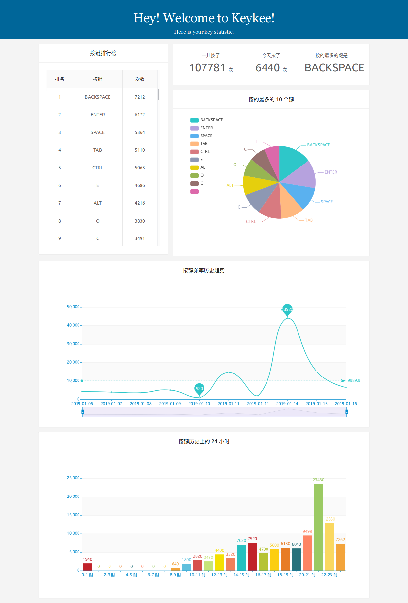

# keykee
这是一个记录键盘的使用情况的软件，目前它长这个样子



## 安装

首先请确保你的电脑上已安装最新版的 node 和 npm，对客户端代码的构建需要用到它们

1.克隆代码仓库到本地

```sh
$ git clone https://gitee.com/zbl1996/keykee.git && cd keykee
```


2.安装依赖

```sh
$ pip install -r requirements.txt
```

3.构建项目
```sh
$ ./buildapp
```

4.安装运行
```sh
$ cd dist
$ sudo ./install
```

5.查看统计

在浏览器中访问 ``http://localhost:7999`` 

## 贡献

如果你有更好的想法，欢迎贡献 pull request
如果你在使用中遇到了问题，请提交 issue 并附上相关 log
目前安装脚本只有 shell 版，欢迎贡献其它平台安装脚本


更多技术文章请关注摆码王子的小屋: https://b.letec.top

